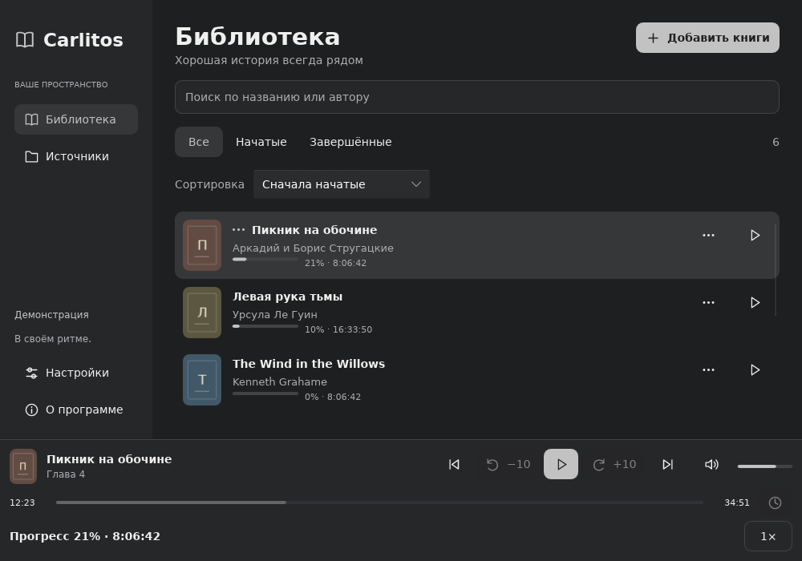
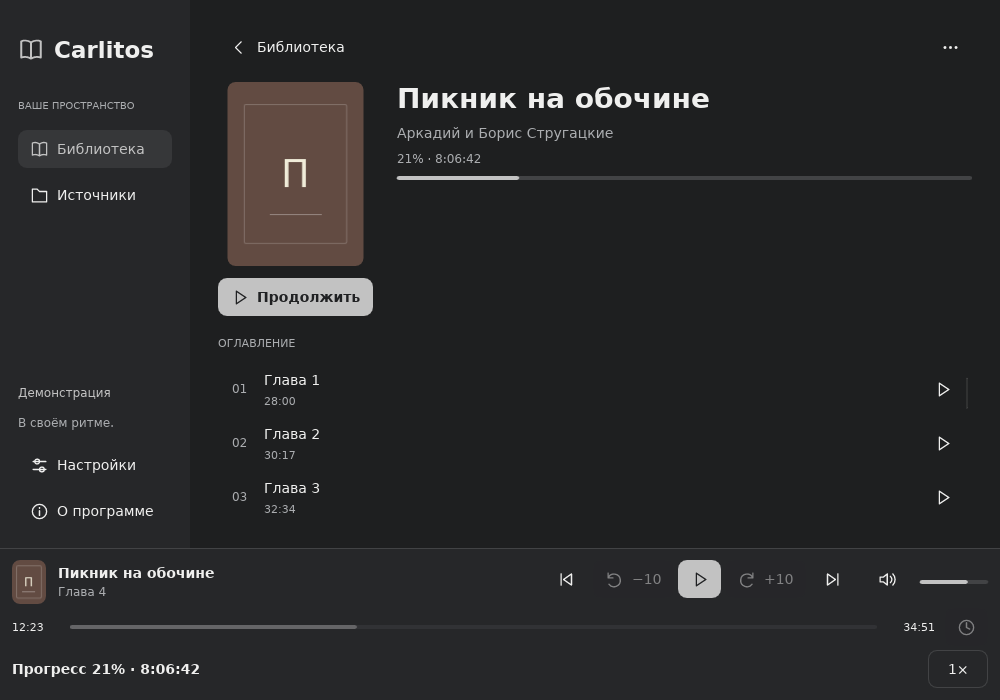
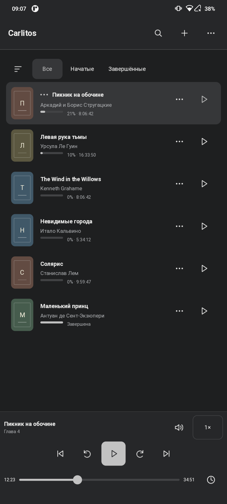
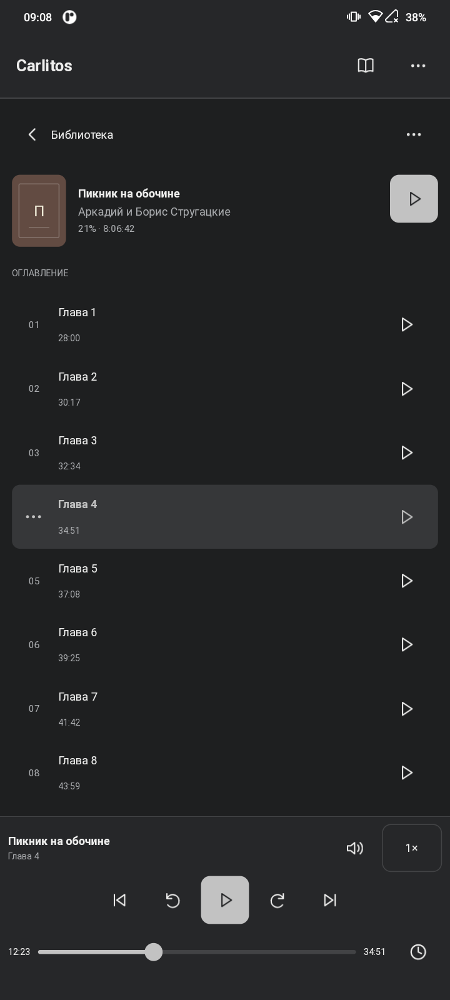

# Carlitos

Плеер локальных аудиокниг для Linux, Windows и Android: библиотека, главы,
сохранение позиции, скорость воспроизведения и пропуск тишины.

[Скачать релиз](https://github.com/mny315/Carlitos/releases/latest): **Windows — Carlitos.exe**,
**Android — ARMv7 / ARM64 / универсальный APK**, **Linux — переносимый архив**.

Сборка на Linux с Nix — через единый `build.sh`:

```sh
./build.sh                 # меню сборки, запуска и групп тестов
./build.sh run             # запуск на Linux
./build.sh linux           # переносимый архив Linux
./build.sh windows         # установщик Windows Carlitos.exe
./build.sh android keygen  # создать локальный ключ Android один раз
./build.sh android         # APK: ARMv7, ARM64 и универсальный
./build.sh all             # релизы для всех трёх платформ
```

[Android](android/README.md) · [Группы тестов](tests/README.md)

Скриншоты с демонстрационной библиотекой. Linux:

<p>
  
  
</p>

Android — Redmi 9C NFC, ARM 32 бита:

<p>
  
  
</p>
